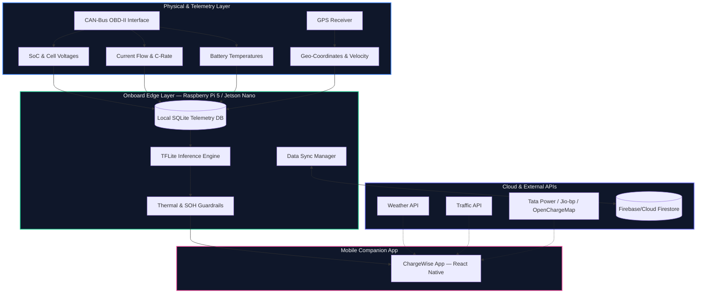
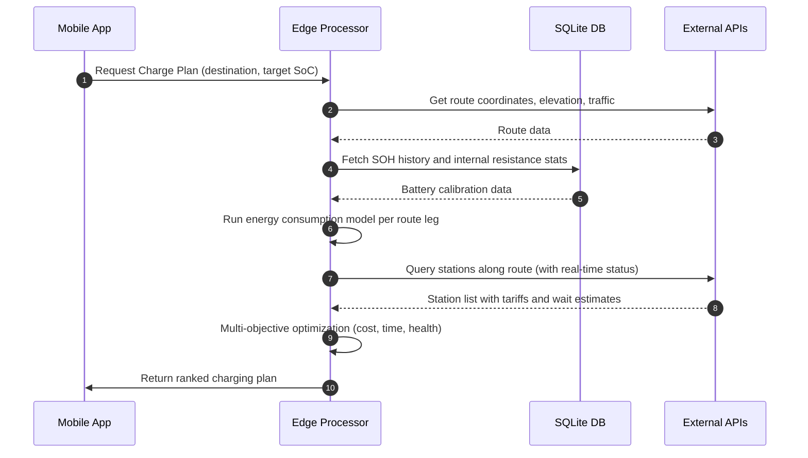
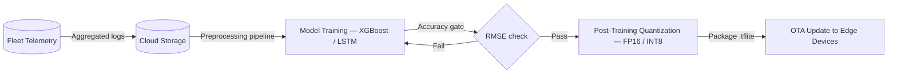

# System Architecture

ChargeWise EdgeAI is split into four layers — physical telemetry, on-vehicle edge processing, cloud/external APIs, and the mobile companion app. The design prioritizes local autonomy: the edge layer handles all safety-critical decisions, and cloud connectivity is treated as optional (useful for model updates and fleet analytics, but never a hard dependency for the core charging recommendation loop).

---

## Overview

---

## Layer Breakdown

### Physical & Telemetry

The edge device connects to the vehicle's CAN-bus via an OBD-II HAT (we tested with the PiCAN2 on a Raspberry Pi 5). This gives us raw access to:

- Individual cell voltages (we care about these individually, not just pack voltage — cell imbalance is an early degradation signal that aggregate readings miss)
- Pack SoC and temperature gradients across cell groups
- Instantaneous charge/discharge current — needed to compute C-rate and dynamic internal resistance in real time

All of this complies with ARAI AIS 156 Phase 2 CAN signal definitions for Indian EV homologation.

### Onboard Edge Layer

This is where the interesting work happens. The Raspberry Pi 5 (8GB) handles CPU inference for the LSTM SOH model and the XGBoost tariff forecaster. For fleet deployments needing faster inference, the NVIDIA Jetson Nano is the drop-in replacement — it runs the same `.tflite` binaries with CUDA acceleration bringing LSTM latency down from ~18ms to ~6ms.

**Local SQLite database** acts as a circular buffer for high-frequency telemetry. We log at 1 Hz, which sounds aggressive, but compressed and downsampled logs are tiny — around 4KB per minute. The buffer automatically prunes records older than 72 hours to prevent storage bloat on the SD card.

**TFLite Inference Engine** loads two quantized models:
- `model_soh_fp16.tflite` — LSTM for State of Health tracking (input: 10-step telemetry window, output: SOH %)
- `model_tariff_xgb.tflite` — gradient boosted tree for MSEDCL tariff slot prediction (input: time + grid load features, output: expected tariff ₹/kWh)

**Safety Guardrail Engine** runs after every inference pass. It compares the predicted SOH and current thermal state against AIS 156 hard limits. If temperature rise rate exceeds 2°C/minute, or if a cell group voltage falls below 3.4V during charging, the guardrail overrides the active charge recommendation immediately and pushes an alert to the companion app — bypassing the normal recommendation queue.

**Data Sync Manager** watches for Wi-Fi or LTE connectivity and uploads compressed telemetry batches and session logs to Firebase when available. It uses an exponential backoff queue, so spotty connectivity in the Ghats doesn't corrupt the sync state.

### Cloud & External APIs

External API calls are handled opportunistically — they enrich recommendations but don't block them:

- **Weather API:** Ambient temperature feeds into the battery chemistry correction factor for range estimation. A 28°C Pune morning vs. a 43°C May afternoon meaningfully changes usable capacity.
- **Traffic API (Google/HERE):** We estimate energy consumption per route leg using a simple energy model weighted by average vehicle speed. Stop-and-go traffic burns more energy per km than expressway cruising.
- **Charging Network APIs:** We query Tata Power EZ Charge, Jio-bp Pulse, Zeon, and the OpenChargeMap registry for real-time station status, connector compatibility (CCS-2, Bharat AC-001, Type-2), and current occupancy. These are cached locally for 15 minutes to reduce API call frequency.

### Mobile Companion App

The companion app communicates with the edge device either over **Bluetooth Low Energy (BLE)** when the user is near the vehicle, or over a local **Wi-Fi socket** (the RPi broadcasts a hotspot). The app never needs internet to show live battery status and charging recommendations — all it needs is a BLE or Wi-Fi connection to the edge device. This is intentional: we wanted the experience to feel instant and local, not cloud-latency-dependent.

---

## Routing & Recommendation Sequence

---

## Model Training & OTA Deployment

Training happens in the cloud on aggregated fleet telemetry. Validated models are quantized and pushed to vehicles via OTA update.

---

## Hardware Performance Numbers

| Platform | RAM Used | SOH Inference Latency | Tariff Inference Latency | Active Power Draw |
| :--- | :--- | :--- | :--- | :--- |
| Raspberry Pi 5 (8GB) | ~120 MB | 18 ms | 1.2 ms | 3.5 W |
| Jetson Nano (4GB) | ~180 MB | 6 ms | 0.8 ms | 6.2 W |
| x86 Dev Machine | ~95 MB | 2 ms | 0.1 ms | — |

The 18ms LSTM latency on the Pi 5 is well within our 1Hz telemetry cycle. We have headroom to run inference at 5Hz if we need higher-resolution SOH tracking on older battery packs showing faster degradation.
