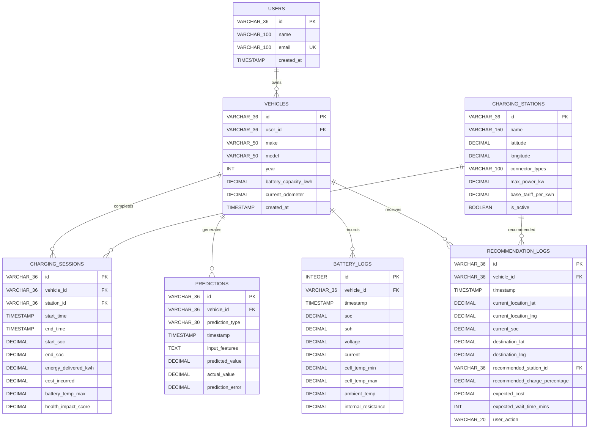

# Database Design

Two databases, two jobs. The edge device runs SQLite locally for fast offline telemetry buffering, and Firebase/Cloud Firestore handles long-term persistence, user profiles, and fleet-wide analytics once connectivity is available.

---

## Schema Overview



---

## Table Notes

**USERS / VEHICLES** — Standard auth and vehicle registration. The `battery_capacity_kwh` field stores usable (not nominal) capacity, since that's what the energy model actually needs. We use UUIDv4 for all primary keys to avoid integer collision issues when merging edge-local logs with cloud records.

**CHARGING_STATIONS** — Seeded from OpenChargeMap and the Tata Power EZ Charge API, refreshed daily via the sync manager. `base_tariff_per_kwh` is the published rate; the XGBoost tariff model adjusts this dynamically based on time-of-day and predicted grid load. Latitude/longitude bounds checked by constraints so bad API data can't corrupt geospatial queries.

**CHARGING_SESSIONS** — The core analytics table. `health_impact_score` is calculated by the edge engine at session end — it's a weighted composite of peak temperature reached, average C-rate during the session, and whether cell voltage imbalance exceeded our 50mV threshold. We use this to correlate charging habits with SOH degradation over time.

**BATTERY_LOGS** — This is the high-frequency circular buffer on the edge device. Logged at 1 Hz during active driving and charging. INTEGER AUTOINCREMENT PK here (not UUID) because this table gets written to constantly and we want minimal write overhead. Older records are pruned by a background job when the table exceeds 100k rows (~28 hours at 1 Hz).

**PREDICTIONS** — Stores every inference output alongside the feature vector that produced it. When actual values come in later (e.g., actual tariff charged at the end of a session), `actual_value` and `prediction_error` get updated. This powers the continuous model drift monitoring.

**RECOMMENDATION_LOGS** — Captures the full recommendation context plus the user's response (ACCEPTED / REJECTED / IGNORED). Rejection patterns feed back into the training pipeline to improve future personalization.

---

## DDL Scripts

```sql
CREATE TABLE IF NOT EXISTS users (
    id          VARCHAR(36) PRIMARY KEY,
    name        VARCHAR(100) NOT NULL,
    email       VARCHAR(100) UNIQUE NOT NULL,
    created_at  TIMESTAMP DEFAULT CURRENT_TIMESTAMP
);

CREATE TABLE IF NOT EXISTS vehicles (
    id                   VARCHAR(36) PRIMARY KEY,
    user_id              VARCHAR(36) NOT NULL REFERENCES users(id) ON DELETE CASCADE,
    make                 VARCHAR(50) NOT NULL,
    model                VARCHAR(50) NOT NULL,
    year                 INTEGER NOT NULL CHECK (year > 2000),
    battery_capacity_kwh DECIMAL(5,2) NOT NULL CHECK (battery_capacity_kwh > 0.0),
    current_odometer     DECIMAL(10,2) NOT NULL,
    created_at           TIMESTAMP DEFAULT CURRENT_TIMESTAMP
);

CREATE TABLE IF NOT EXISTS charging_stations (
    id                  VARCHAR(36) PRIMARY KEY,
    name                VARCHAR(150) NOT NULL,
    latitude            DECIMAL(9,6) NOT NULL CHECK (latitude BETWEEN -90.0 AND 90.0),
    longitude           DECIMAL(9,6) NOT NULL CHECK (longitude BETWEEN -180.0 AND 180.0),
    connector_types     VARCHAR(100) NOT NULL,
    max_power_kw        DECIMAL(5,2) NOT NULL CHECK (max_power_kw > 0.0),
    base_tariff_per_kwh DECIMAL(6,2) NOT NULL,
    is_active           BOOLEAN DEFAULT 1
);

CREATE TABLE IF NOT EXISTS charging_sessions (
    id                   VARCHAR(36) PRIMARY KEY,
    vehicle_id           VARCHAR(36) NOT NULL REFERENCES vehicles(id) ON DELETE CASCADE,
    station_id           VARCHAR(36) NOT NULL REFERENCES charging_stations(id),
    start_time           TIMESTAMP NOT NULL,
    end_time             TIMESTAMP,
    start_soc            DECIMAL(5,2) NOT NULL CHECK (start_soc BETWEEN 0.0 AND 100.0),
    end_soc              DECIMAL(5,2) CHECK (end_soc BETWEEN 0.0 AND 100.0),
    energy_delivered_kwh DECIMAL(5,2),
    cost_incurred        DECIMAL(8,2),
    battery_temp_max     DECIMAL(4,1),
    health_impact_score  DECIMAL(4,2),
    CHECK (end_soc >= start_soc)
);

CREATE TABLE IF NOT EXISTS predictions (
    id               VARCHAR(36) PRIMARY KEY,
    vehicle_id       VARCHAR(36) NOT NULL REFERENCES vehicles(id) ON DELETE CASCADE,
    prediction_type  VARCHAR(30) NOT NULL CHECK (prediction_type IN ('TARIFF', 'SOH', 'ANOMALY')),
    timestamp        TIMESTAMP DEFAULT CURRENT_TIMESTAMP,
    input_features   TEXT NOT NULL,
    predicted_value  DECIMAL(10,4) NOT NULL,
    actual_value     DECIMAL(10,4),
    prediction_error DECIMAL(10,4)
);

CREATE TABLE IF NOT EXISTS battery_logs (
    id                  INTEGER PRIMARY KEY AUTOINCREMENT,
    vehicle_id          VARCHAR(36) NOT NULL REFERENCES vehicles(id) ON DELETE CASCADE,
    timestamp           TIMESTAMP NOT NULL,
    soc                 DECIMAL(5,2) NOT NULL CHECK (soc BETWEEN 0.0 AND 100.0),
    soh                 DECIMAL(5,2) NOT NULL CHECK (soh BETWEEN 0.0 AND 100.0),
    voltage             DECIMAL(6,2) NOT NULL,
    current             DECIMAL(6,2) NOT NULL,
    cell_temp_min       DECIMAL(4,1) NOT NULL,
    cell_temp_max       DECIMAL(4,1) NOT NULL,
    ambient_temp        DECIMAL(4,1),
    internal_resistance DECIMAL(8,6)
);

CREATE TABLE IF NOT EXISTS recommendation_logs (
    id                            VARCHAR(36) PRIMARY KEY,
    vehicle_id                    VARCHAR(36) NOT NULL REFERENCES vehicles(id) ON DELETE CASCADE,
    timestamp                     TIMESTAMP DEFAULT CURRENT_TIMESTAMP,
    current_location_lat          DECIMAL(9,6) NOT NULL,
    current_location_lng          DECIMAL(9,6) NOT NULL,
    current_soc                   DECIMAL(5,2) NOT NULL CHECK (current_soc BETWEEN 0.0 AND 100.0),
    destination_lat               DECIMAL(9,6) NOT NULL,
    destination_lng               DECIMAL(9,6) NOT NULL,
    recommended_station_id        VARCHAR(36) NOT NULL REFERENCES charging_stations(id),
    recommended_charge_percentage DECIMAL(5,2) NOT NULL CHECK (recommended_charge_percentage BETWEEN 10.0 AND 100.0),
    expected_cost                 DECIMAL(8,2) NOT NULL,
    expected_wait_time_mins       INTEGER NOT NULL,
    user_action                   VARCHAR(20) DEFAULT 'PENDING'
        CHECK (user_action IN ('PENDING', 'ACCEPTED', 'REJECTED', 'IGNORED'))
);
```

---

## Indexes

Three indexes cover the main performance-sensitive query patterns:

```sql
-- Most common query: get recent SOH trend for a specific vehicle
CREATE INDEX IF NOT EXISTS idx_battery_logs_timestamp
ON battery_logs(vehicle_id, timestamp DESC);

-- Geospatial bounding-box search for nearby active stations
CREATE INDEX IF NOT EXISTS idx_stations_coords
ON charging_stations(latitude, longitude) WHERE is_active = 1;

-- Load charging history for the driver's session list screen
CREATE INDEX IF NOT EXISTS idx_sessions_vehicle
ON charging_sessions(vehicle_id, start_time DESC);
```

We deliberately skipped indexing `prediction_type` on the predictions table because reads on that column always happen alongside a `vehicle_id` filter anyway — a composite index would be redundant overhead on an edge device with limited I/O throughput.
