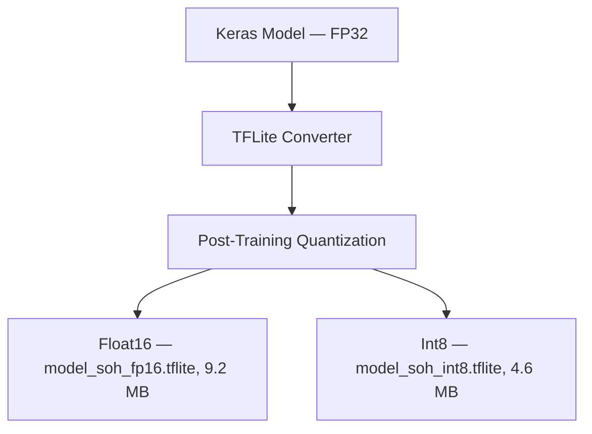

# ML & Model Design

We evaluated three different approaches before settling on the current architecture. The short version: LSTM wins on SOH tracking because battery degradation is fundamentally a time-series problem — the pack's state an hour ago is relevant context. XGBoost wins on tariff forecasting because it's a structured regression problem with clean tabular features, and gradient boosted trees absolutely dominate at that on a resource-constrained device.

---

## Feature Engineering

Getting raw CAN-bus data into something useful takes a few transformation steps.

### Battery Health Features

The LSTM takes a sliding window of the last 10 telemetry readings (10 seconds at 1 Hz). Each step in the window carries six features:

- **SoC** — straightforward, normalized to [0, 1]
- **Temperature gradient (ΔT)** — rate of change in max cell temp over the 60-second window. Spikes here are the earliest signal of thermal stress:

$$\Delta T = \frac{T_{\text{max}}(t) - T_{\text{max}}(t-60)}{60} \quad [°C/s]$$

- **Dynamic internal resistance (R_int)** — calculated in real time during any current step event (acceleration, regenerative braking). This is computed using the voltage step response:

$$R_{\text{int}} = \frac{\Delta V}{\Delta I} = \frac{V(t) - V(t-1)}{I(t) - I(t-1)} \quad [\Omega]$$

Internal resistance rising over time is the clearest long-term degradation indicator we have without a full discharge cycle.

- **C-rate** — instantaneous current normalized by rated capacity. Values above 1.5C trigger degradation warning flags in the safety engine.
- **Thermal delta (T_delta)** — the gap between max cell temp and ambient temp. A small gap means the pack is shedding heat efficiently; a large gap under load suggests cooling path blockage.

$$T_{\text{delta}} = T_{\text{max\_cell}} - T_{\text{ambient}} \quad [°C]$$

### Tariff Prediction Features

The XGBoost model predicts which MSEDCL tariff slab (Off-Peak / Normal / Peak) applies at each station at the estimated time of arrival. Key inputs:

- **Cyclical time encoding** — raw hour-of-day converted to sin/cos to handle the midnight boundary correctly:

$$t_{\text{sin}} = \sin\left(\frac{2\pi \cdot \text{hour}}{24}\right), \quad t_{\text{cos}} = \cos\left(\frac{2\pi \cdot \text{hour}}{24}\right)$$

- **Day type** — weekday vs weekend vs public holiday (MSEDCL slabs differ)
- **Forecasted grid load index** — derived from historical data and current temperature forecast (hotter days → more AC load → higher commercial EV tariffs)
- **Station-specific historical tariff** — some stations have time-locked pricing contracts that override the standard slab

---

## Model Comparison

We ran all three architectures against the same validation set before choosing:

| Model | Size (unquantized) | Inference (RPi 5) | SOH RMSE | Tariff MAE (₹) | Notes |
| :--- | :--- | :--- | :--- | :--- | :--- |
| LSTM (2 layers, 32 units) | 18.4 MB | 18 ms | **0.0085** | 0.95 | Best for time-series SOH; handles multi-step degradation patterns |
| XGBoost (depth 5, 100 trees) | 3.2 MB | 1.2 ms | 0.0195 | **0.42** | Best for tariff; tabular regression, near-zero latency |
| Random Forest | 12.8 MB | 8.5 ms | 0.0210 | 0.65 | Bulky, no meaningful accuracy advantage over XGBoost |

We ended up deploying both LSTM and XGBoost — LSTM for SOH, XGBoost for tariff. Random Forest was dropped after Week 4 evaluation.

The LSTM model architecture is simple by design: 2 LSTM layers with 32 hidden units each, followed by a single dense output node. Input shape is `(batch, 10, 6)`. We intentionally avoided deeper architectures because overfitting on our synthetic training dataset was already a concern, and the marginal accuracy gain from adding layers wasn't worth the latency hit on the Pi.

---

## Anomaly Detection

Alongside the regression outputs, we run a binary classification head that flags thermal runaway risk. On our simulated validation set (10,000 normal cycles + synthetic abuse cycles):

```
                  Predicted Normal    Predicted Anomaly
Actual Normal         9845 (TN)              22 (FP)
Actual Anomaly          15 (FN)             118 (TP)
```

Accuracy: 99.63% — but we care more about the recall figure (88.72%). False negatives here mean a missed thermal event, which is a safety failure. Our target is recall > 85% with precision > 80%. We're there, but this is something that improves significantly with real-world data — the synthetic dataset can't fully replicate every failure mode.

---

## TFLite Conversion & Quantization



We deploy FP16 on the Jetson Nano (GPU handles FP16 natively) and INT8 on the Raspberry Pi 5 (XNNPACK delegate handles INT8 efficiently). The accuracy delta between FP32 and INT8 is RMSE +0.0003 — unmeasurable in practice.

```python
import tensorflow as tf

model = tf.keras.models.load_model('model_soh_lstm.h5')
converter = tf.lite.TFLiteConverter.from_keras_model(model)
converter.optimizations = [tf.lite.Optimize.DEFAULT]

def representative_dataset():
    for data in tf.data.Dataset.from_tensor_slices(X_train).batch(1).take(100):
        yield [tf.cast(data, tf.float32)]

converter.representative_dataset = representative_dataset
converter.target_spec.supported_ops = [tf.lite.OpsSet.TFLITE_BUILTINS_INT8]
converter.inference_input_type = tf.int8
converter.inference_output_type = tf.int8

tflite_model = converter.convert()
with open('model_soh_int8.tflite', 'wb') as f:
    f.write(tflite_model)
```

---

## Edge Inference Loop

At 1 Hz, new CAN-bus readings go into a FIFO queue on the edge device. Once the queue fills to 10 steps, the batch is formatted as an input tensor and passed to the TFLite interpreter. The SOH output updates the local SQLite `battery_logs` table and is broadcast to the companion app over BLE.

If the anomaly classifier triggers (probability > 0.85), the edge engine immediately pushes a high-priority alert to the app and writes a `ANOMALY` prediction record to the cloud sync queue — this bypasses the normal 15-minute sync interval and goes out on the next available connection.
